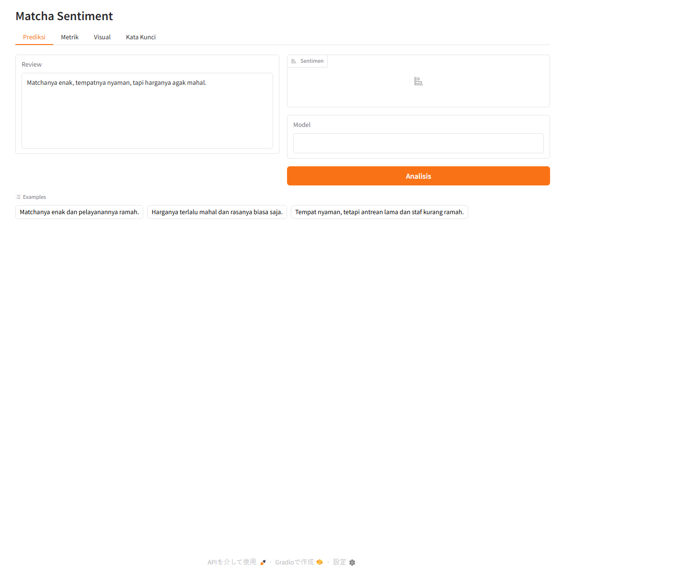
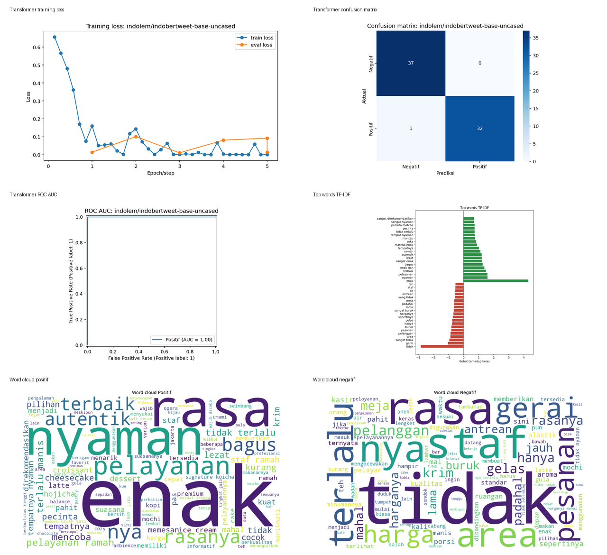
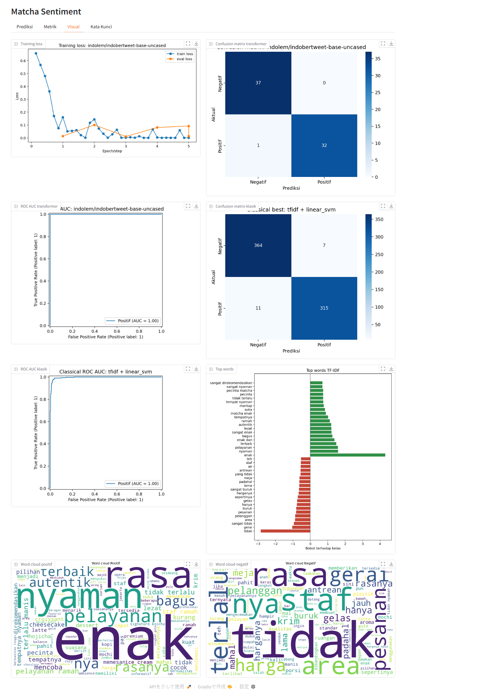
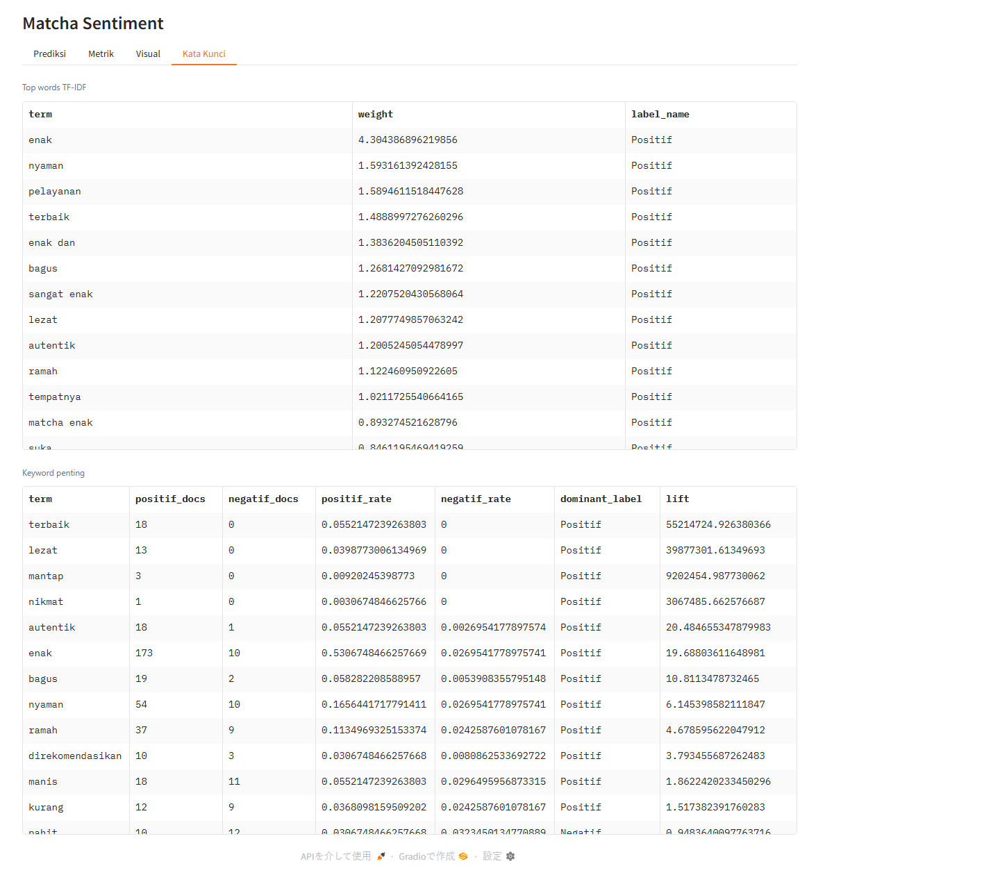
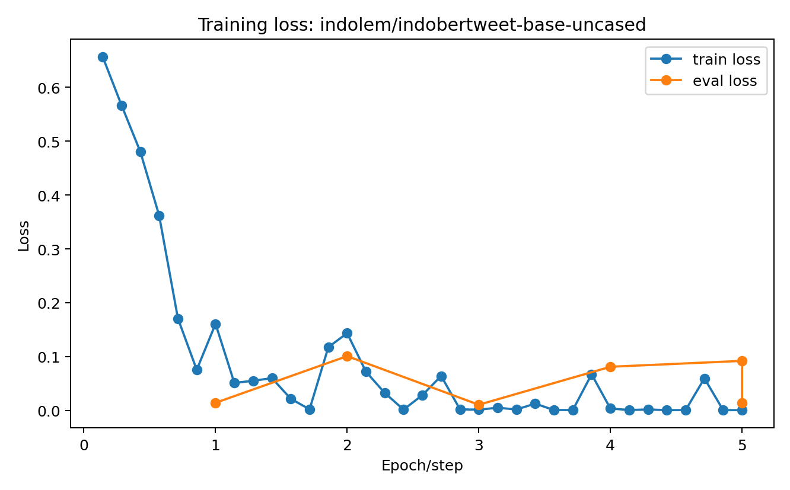
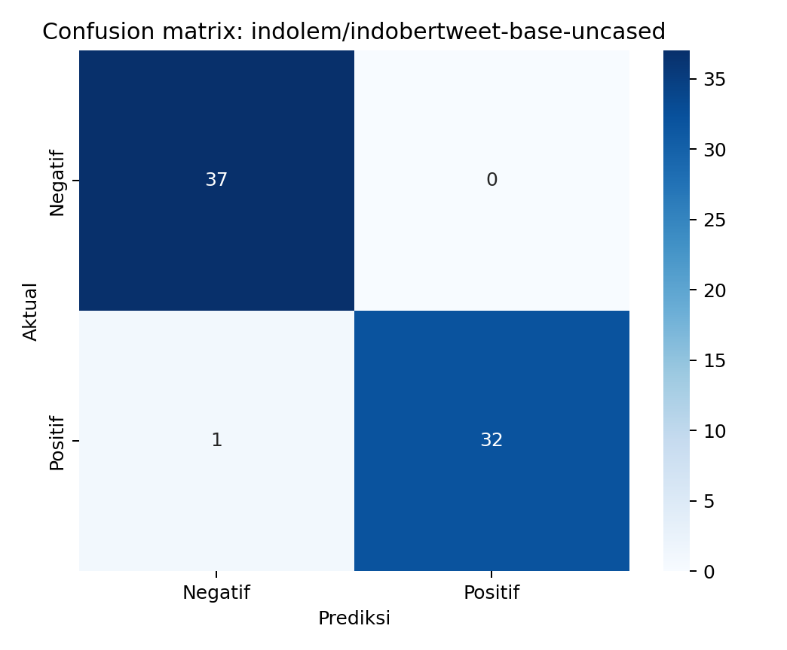
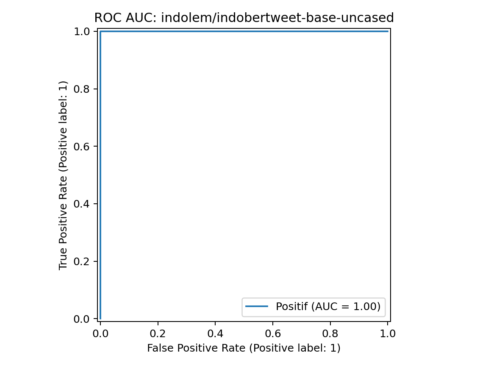
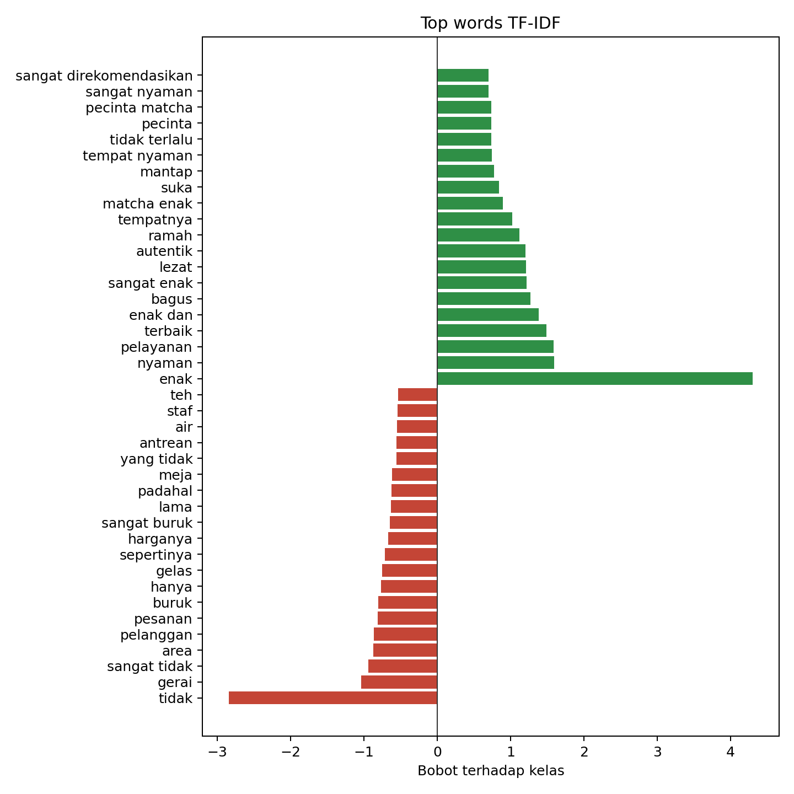
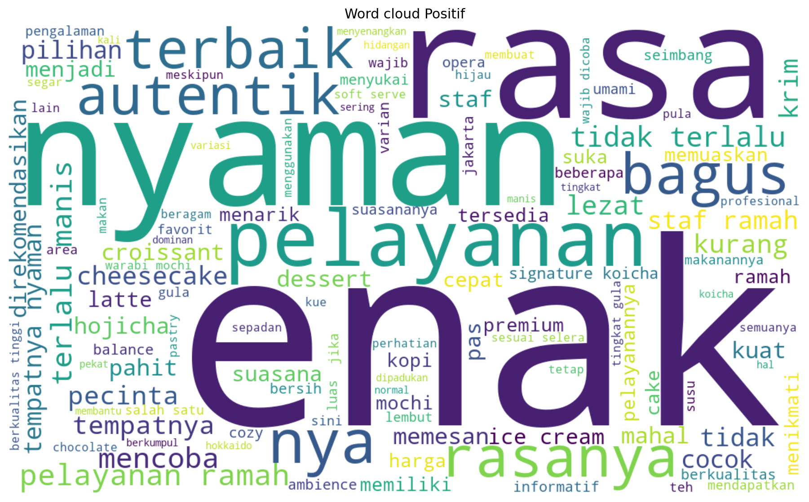
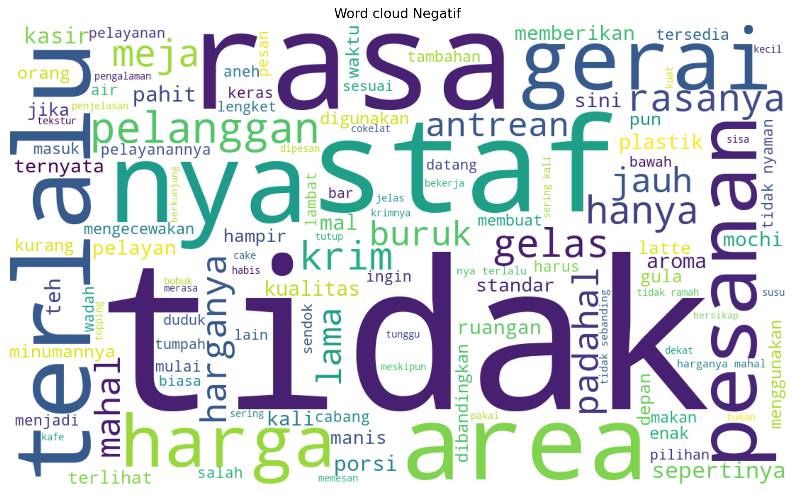

# Matcha Sentiment

Sentiment analysis bahasa Indonesia untuk review Matchaya/IKUYO. Dataset dibersihkan menjadi klasifikasi biner `Negatif` dan `Positif`, lalu dibandingkan dengan baseline machine learning klasik dan fine-tuning 5 model Transformer Indonesia.



## Ringkasan

| Area | Hasil |
| --- | --- |
| Dataset final | 697 review |
| Label | 371 `Negatif`, 326 `Positif` |
| Label dihapus | 14 `Netral` |
| Duplikat dibuang | 46 teks |
| Best classical | `TF-IDF + Linear SVM` |
| Best Transformer | `indolem/indobertweet-base-uncased` |
| Runtime | Docker + NVIDIA GPU |
| Dashboard | Gradio, siap Hugging Face Spaces |

> Catatan push: model Transformer terbaik berukuran sekitar 442 MB. Repo ini sudah menyiapkan `.gitattributes` untuk Git LFS, jadi jalankan `git lfs install` sebelum commit kalau model ingin ikut dipush.

## Hasil Utama

### Transformer

| Model | Accuracy | Precision | Recall | F1 | ROC AUC |
| --- | ---: | ---: | ---: | ---: | ---: |
| `indolem/indobertweet-base-uncased` | 0.9857 | 1.0000 | 0.9697 | 0.9846 | 1.0000 |
| `indobenchmark/indobert-base-p1` | 0.9714 | 1.0000 | 0.9394 | 0.9688 | 1.0000 |
| `indobenchmark/indobert-base-p2` | 0.9714 | 1.0000 | 0.9394 | 0.9688 | 1.0000 |
| `flax-community/indonesian-roberta-base` | 0.9571 | 0.9688 | 0.9394 | 0.9538 | 0.9967 |
| `indolem/indobert-base-uncased` | 0.9143 | 0.9355 | 0.8788 | 0.9063 | 0.9918 |

Model terbaik sudah disimpan di:

```text
models/best_transformer
```

### Machine Learning Klasik

TF-IDF dan Word2Vec diuji dengan Stratified 10-fold cross validation. Hasil terbaik:

| Feature | Model | Accuracy | Precision | Recall | F1 | ROC AUC |
| --- | --- | ---: | ---: | ---: | ---: | ---: |
| TF-IDF | Linear SVM | 0.9742 | 0.9783 | 0.9663 | 0.9722 | 0.9960 |
| Word2Vec | Extra Trees | 0.9699 | 0.9841 | 0.9509 | 0.9672 | 0.9958 |
| Word2Vec | Linear SVM | 0.9656 | 0.9719 | 0.9540 | 0.9628 | 0.9956 |
| Word2Vec | Logistic Regression | 0.9656 | 0.9809 | 0.9448 | 0.9625 | 0.9955 |
| TF-IDF | Logistic Regression | 0.9656 | 0.9840 | 0.9417 | 0.9624 | 0.9953 |

## Visual Evaluasi



### Dashboard

| Prediksi | Visual | Kata Kunci |
| --- | --- | --- |
|  |  |  |

### Detail Plot

| Training Loss | Confusion Matrix | ROC AUC |
| --- | --- | --- |
|  |  |  |

| Top Words | Word Cloud Positif | Word Cloud Negatif |
| --- | --- | --- |
|  |  |  |

## Kata Kunci Bermakna

Beberapa kata yang paling membantu membaca arah sentimen:

| Kata | Positif Docs | Negatif Docs | Dominan |
| --- | ---: | ---: | --- |
| `enak` | 173 | 10 | Positif |
| `nyaman` | 54 | 10 | Positif |
| `ramah` | 37 | 9 | Positif |
| `terbaik` | 18 | 0 | Positif |
| `mahal` | 10 | 24 | Negatif |
| `harga` | 10 | 28 | Negatif |
| `buruk` | 0 | 19 | Negatif |
| `antrean` | 0 | 19 | Negatif |
| `lama` | 1 | 16 | Negatif |

File lengkapnya ada di:

```text
artifacts/classical/keyword_counts.csv
```

## Struktur Proyek

```text
.
├── app.py
├── Dockerfile
├── docker-compose.yml
├── INSTALL_DOCKER.md
├── data/processed/matcha_sentiment_binary.csv
├── docs/images/
├── artifacts/
├── models/best_transformer/
├── models/classical/best_model.joblib
├── scripts/
└── src/matcha_sentiment/
```

## Quick Start

```bash
docker build -t matcha-sentiment .
docker run --rm --gpus all -p 7860:7860 -v "${PWD}:/workspace" matcha-sentiment
```

Buka:

```text
http://localhost:7860
```

Panduan dari nol sampai deploy ada di [INSTALL_DOCKER.md](INSTALL_DOCKER.md).

## Catatan

Skor evaluasi sangat tinggi karena dataset masih kecil dan domainnya sempit. Model ini sudah bagus untuk demo, dashboard, dan eksperimen sentiment analysis review matcha, tetapi untuk production lintas brand atau lintas kategori sebaiknya ditambah data baru yang lebih beragam.
# matchaSentiment
